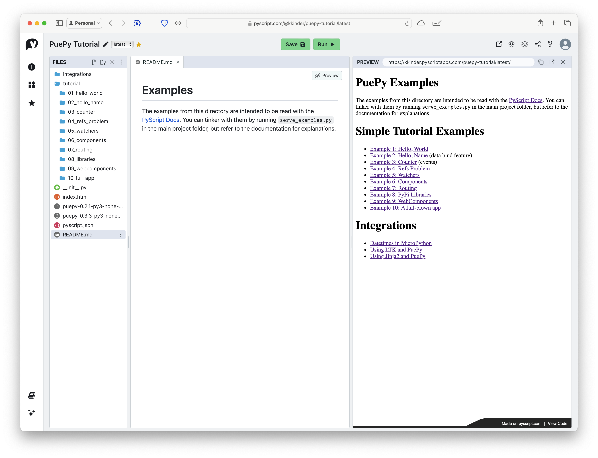
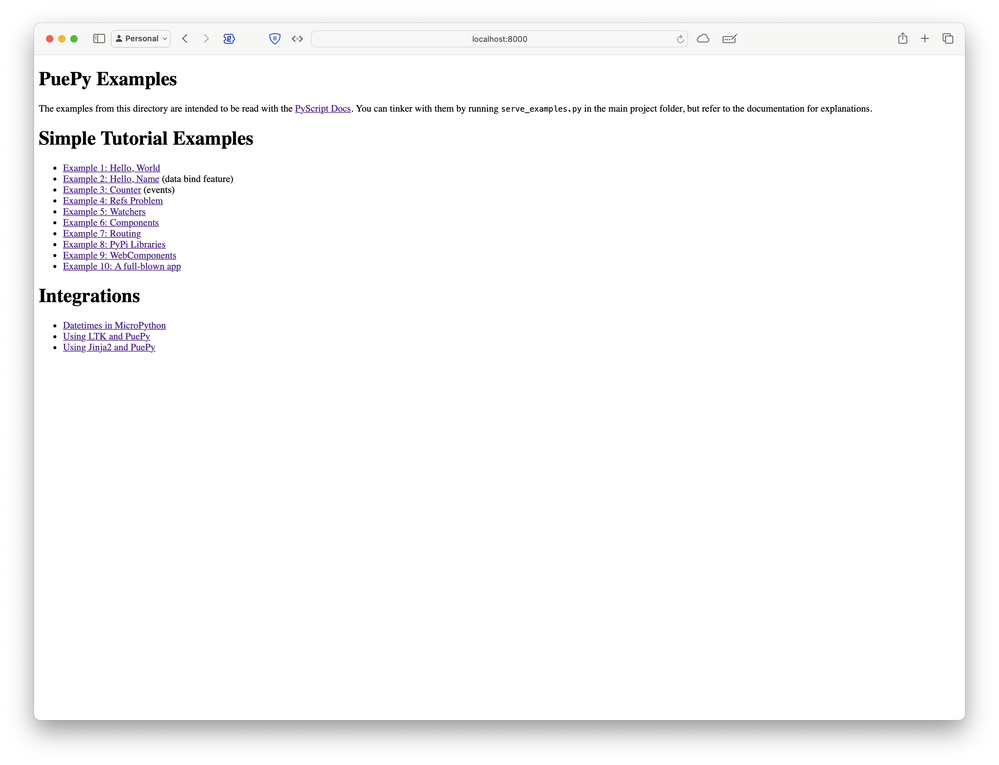

# Using This Tutorial

Each of the examples in this tutorial can be run on PyScript.com, a web environment that lets you write, test, and share PyScript code. Alternatively, you can clone the [PuePy git repo](https://github.com/kkinder/puepy) and run a live web server with each example included.

The PyScript.com environment uses the PuePy `.whl` file, as [downloadable from PiWheels](https://www.piwheels.org/project/puepy/), while the examples in the git repository are served with PuePy directly from source files on disk.

## Using PyScript.com

Navigate to [https://pyscript.com/@kkinder/puepy-tutorial/latest](https://pyscript.com/@kkinder/puepy-tutorial/latest) and you are greeted with a list of files on the left, a code editor in the middle, and a running example on the left. Each chapter in the tutorial corresponds with a directory in `tutorial` folder on the left.

You can clone the entire examples project and edit it yourself to continue your learning:

Once cloned you make your own changes and experiment with them in real time.

## Editing locally

After cloning [puepy on git](https://github.com/kkinder/puepy), you can run the examples using a simple script:

http://localhost:8000/ show you a list of examples

As you edit them in the `examples` folder and reload the window, your changes will be live.

## Live Examples

Most of the examples you see live in this tutorial include example code running live in a browser like this:

<puepy/>

There, you can see the running example inline with its explanation. You can also edit the code on PyScript.com by navigating to its example folder and cloning the project, as described above.
